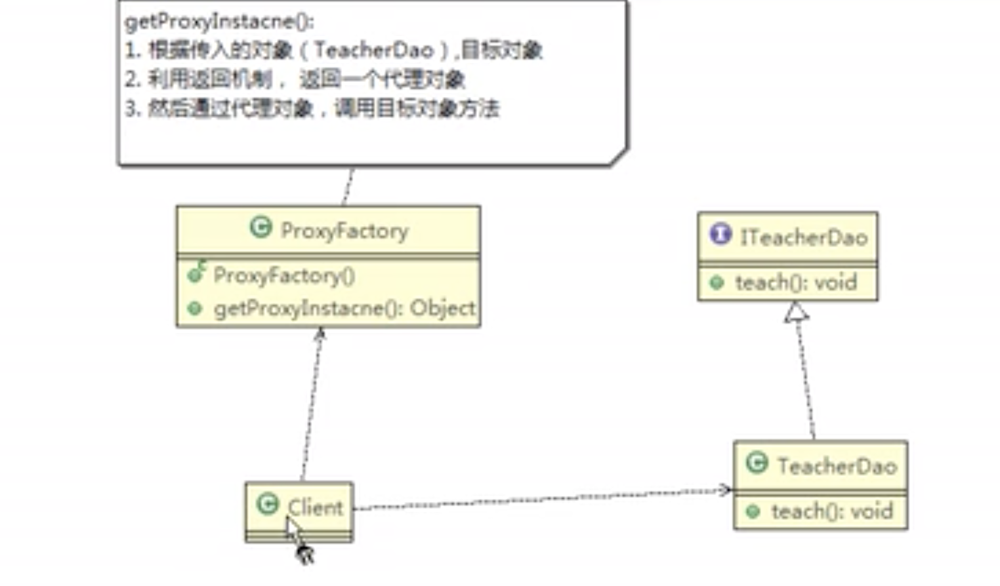
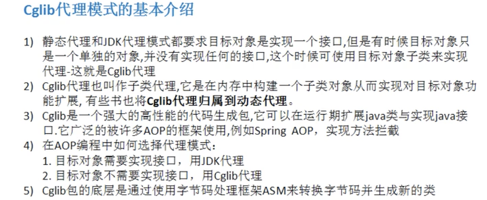

# 代理模式

1. 静态代理

- 优点：在不修改目标对象的功能前提下，能通过代理对象对目标功能扩展
- 缺点：因为代理对象需要与目标对象实现一样的接口，所以会有很对代理类。一旦接口增加方法，目标和代理对象都要维护。

2. 动态代理
   概念：代理对象，不需要实现接口，但是目标对象要实现接口，否则不能用动态代理。动态代理的生成是利用JDK的API，动态的在内存中构建代理对象。动态代理也叫做JDK代理，接口代理

3. Cglib代理

