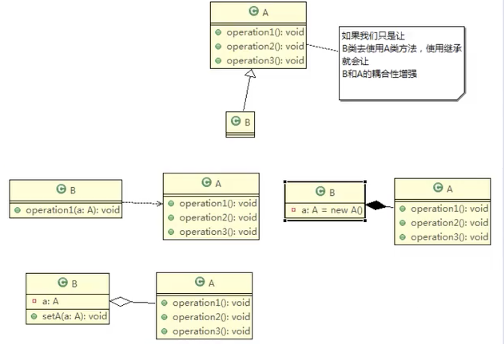
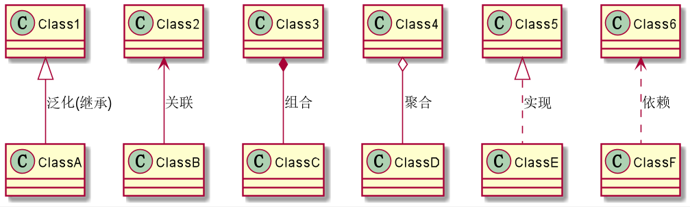
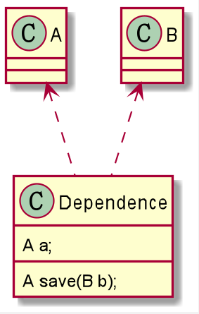
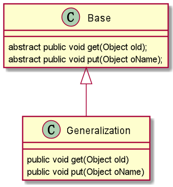
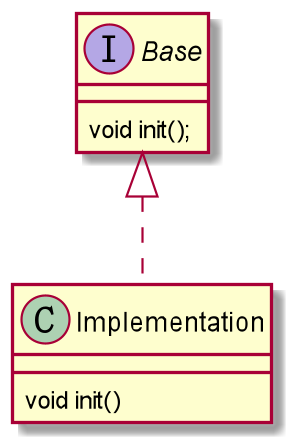
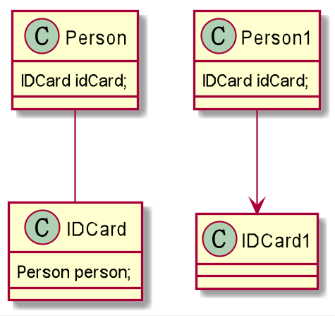
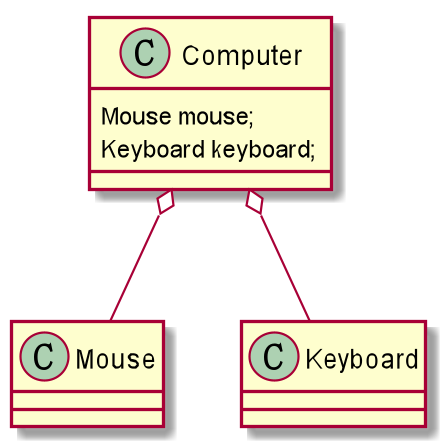
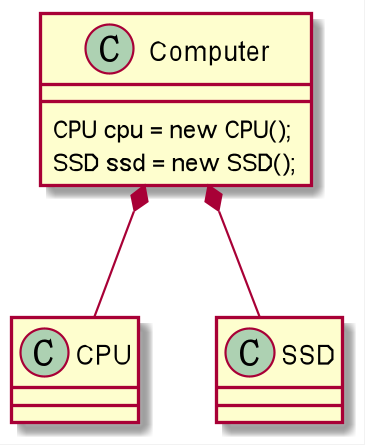

# 合成复用原则





- IDEA PlantUML表示类与类之间的关系的符号
```
@startuml

Class1 <|-- ClassA:泛化
Class2 <-- ClassB:关联
Class3 *-- ClassC:组合
Class4 o-- ClassD:聚合
Class5 <|.. ClassE:实现
Class6 <.. ClassF:依赖

@enduml
```



1. 依赖（Dependence）
只要是在类中用到了对方，那么他们之间就存在依赖关系。如果没有对方，连编绎都通过不了。

- 类中用到了对方；
- 类的成员属性；
- 方法的返回类型；
- 方法接收的参数类型；
- 方法中使用到。



```
public class Dependence {
    A a;//TODO 类的成员属性

    public A save(B b) {//TODO 方法接收的参数类型
        //TODO 方法的返回类型
        System.out.println("");
        A a = new A();//TODO 方法中使用到
        return a;
    }
}

class A {}

class B {}
```

2. 继承（泛化 Generalization）
泛化关系实际上就是继承关系，依赖关系的特例


```
public class Generalization extends Base {

    @Override
    public void get(Object oId) {

    }

    @Override
    public void put(Object oName) {

    }
}

abstract class Base {
    abstract public void get(Object oId);

    abstract public void put(Object oName);
}
```

3. 实现（Realization）
实现关系实际上就是 A类 实现 B接口，依赖关系的特例。


```
public class Implementation implements Base {
    @Override
    public void init() {
        System.out.println("init");
    }
}

interface Base {
    void init();
}
```

4. 关联（Association）
类与类之间的关系，依赖关系的特例。关联具有导航性：即双向关系或单向关系



```
public class Person {
    private IDCard idCard;
}

class IDCard {
    //private Person person;
}
```

5. 聚合（Aggregation）
表示的是整体和部分的关系，整体与部分可以分开，关联关系的特例。

聚合关系是关联关系的特例，所以他具有关联的导航性与多重性


```
public class Computer {
    private Mouse mouse;
    private Keyboard keyboard;

    public void setMouse(Mouse mouse) {
        this.mouse = mouse;
    }

    public void setKeyboard(Keyboard keyboard) {
        this.keyboard = keyboard;
    }
}

class Mouse {}

class Keyboard {}
```

6. 组合（Composite）

整体与部分的关系，但是整体与部分不可以分开，关联关系的特例。

级联删除就是组合关系。


```
public class Computer {
   private CPU cpu = new CPU();
   private SSD ssd = new SSD();
}

class CPU {}

class SSD {}
```