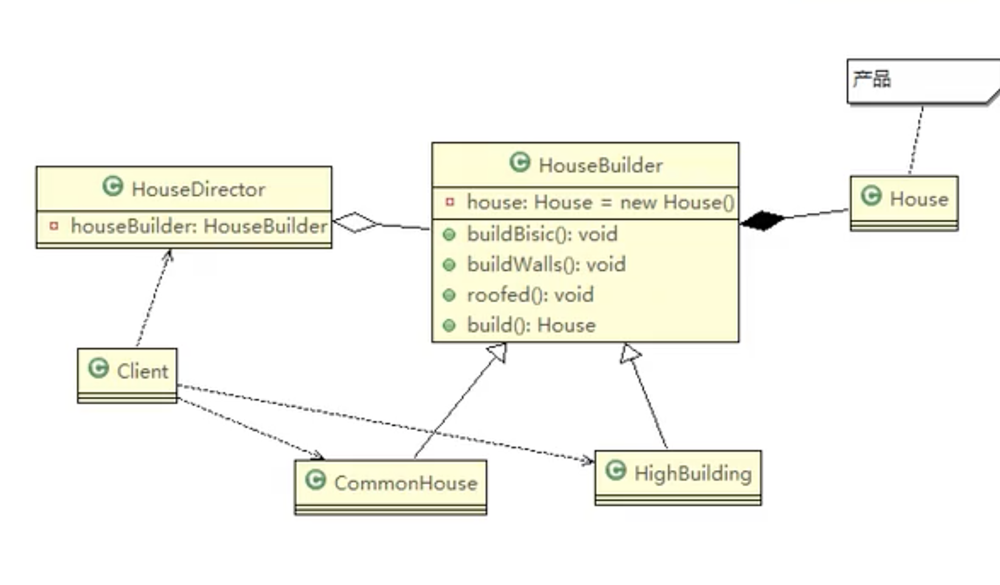

# 建造者模式

四个角色

- Product(产品角色)：一个具体的产品对象
- Builder(抽象建造者)：创建一个Product对象的各个部件指定的接口 // 抽象类
- ConcreateBuilder（具体建造者)：实现接口，建造和装配各个部件
- Dorector(指挥者)：构建一个使用Builder接口的对象。他主要是用于创建一个复杂的对象，他主要由两个作用。
  1. 隔离了客户与对象的生产过程
  2. 负责控制产品对象的生产过程

